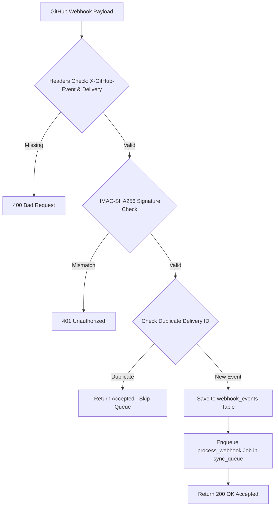
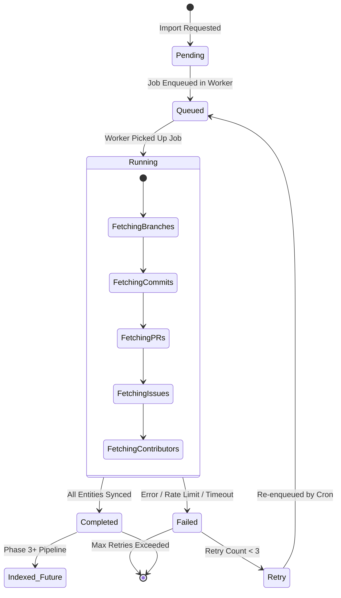
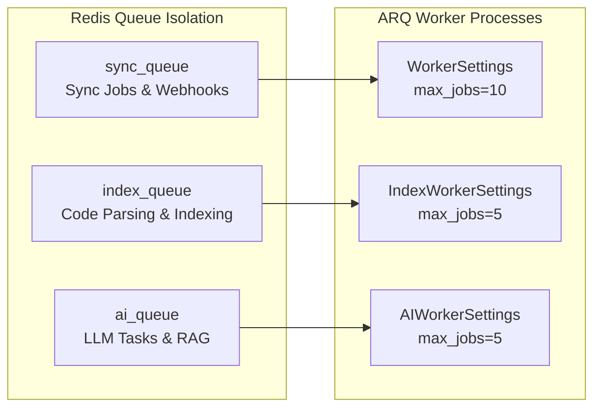
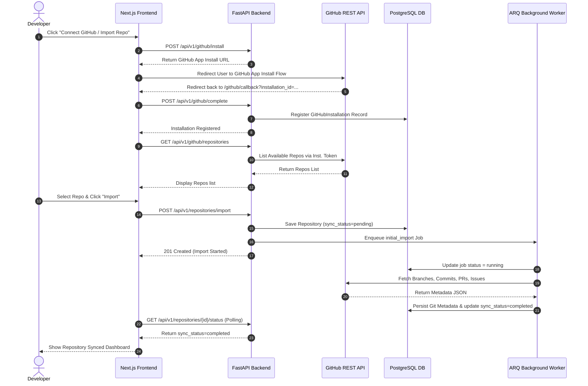

# GitHub Integration Architecture & Reference — Forge

> **Project:** Forge  
> **Document:** GitHub Integration Guide & Technical Reference  
> **Version:** 1.0.0  
> **Last Updated:** July 2026  
> **Status:** Production / Active  
> **Target Audience:** Backend Developers, Integrations Engineers, Security Team, DevOps

---

## 1. Overview & Architecture

Forge integrates with GitHub to sync repositories, track metadata (branches, commits, pull requests, issues, contributors, languages, topics), and power the AI-native developer operating system.

Forge uses the **GitHub App Security & Authentication Model** instead of Personal Access Tokens (PATs). This provides granular, least-privilege permissions, organization-level installation management, short-lived installation access tokens, and webhook event notifications.

```text
+-----------------------------------------------------------------------------------+
|                                 Forge Web Platform                                |
+-----------------------------------------------------------------------------------+
       |                                      |                               |
  OAuth Flow                          REST API Calls                     Webhooks
       |                                      |                               |
       v                                      v                               v
+------------------+                 +------------------+           +------------------+
| GitHub OAuth URL |                 | FastAPI Engine   |           | FastAPI Webhook  |
| (User Link)      |                 | (GitHub Services)|           | Endpoint         |
+------------------+                 +--------+---------+           +--------+---------+
       |                                      |                              |
       | Token Exchange                       | App JWT / Inst. Token        | Signature Check
       v                                      v                              v
+-----------------------------------------------------------------------------------+
|                                   GitHub REST API                                 |
+-----------------------------------------------------------------------------------+
```

### Core Architecture Components

1. **GitHub App Module (`app.integrations.github`)**:
   - `app_auth.py`: Handles GitHub App RS256 JWT generation, installation token exchange, and user-to-server OAuth code exchange.
   - `client.py`: Provides `GitHubClient`, an asynchronous REST client using short-lived installation tokens with automatic in-memory caching and rate-limit tracking.
   - `webhooks.py`: Verifies HMAC-SHA256 signature headers (`X-Hub-Signature-256`) using constant-time string comparison (`hmac.compare_digest`).
2. **Service Layer (`app.services`)**:
   - `github_service.py`: Orchestrates user account linking, App installations registration, repository browsing, and imports.
   - `sync_engine.py`: Manages initial imports, repository sync jobs, data extraction, and entity persistence.
   - `webhook_service.py`: Ingests raw webhook events, checks delivery IDs for deduplication, verifies signatures, and enqueues worker tasks.
3. **Background Worker Engine (`app.workers`)**:
   - Powered by **ARQ** connected to Redis.
   - Tasks: `initial_import`, `repository_sync`, `process_webhook`, `retry_failed_jobs`, `periodic_sync`, `cleanup`.

---

## 2. Repository Lifecycle

```text
Connect GitHub
      │
      ▼
Install GitHub App
      │
      ▼
OAuth Link
      │
      ▼
Import Repository
      │
      ▼
Initial Sync
      │
      ▼
Webhook Updates
      │
      ▼
Periodic Sync
      │
      ▼
Repository Ready
      │
      ▼
Repository Intelligence Roadmap
```

---

## 3. GitHub App Permissions & Webhook Events

Forge requests minimal, granular permissions scoped strictly to required operations:

### Permissions Matrix

| Permission Category | Scope | Access Level | Purpose |
| :--- | :--- | :--- | :--- |
| **Contents** | Repository | **Read** | Sync file trees, branches, and commit metadata. |
| **Metadata** | Repository | **Read** | Mandatory base access for repo info, IDs, and stars. |
| **Pull Requests** | Repository | **Read** | Sync PR numbers, titles, states, authors, and branches. |
| **Issues** | Repository | **Read** | Sync issue numbers, states, labels, and authors. |
| **Commit Statuses**| Repository | **Read** | Track build status signals on commits. |
| **Actions** | Repository | *Read (Future Phase 2)*| Monitor CI/CD workflow runs and test outcomes. |
| **Checks** | Repository | *Read (Future Phase 2)*| Inspect detailed check suites and linters. |
| **Organization Members**| Organization | **Read** | Validate organization membership during user linking. |

### Subscribed Webhook Events

- `installation` & `installation_repositories`: Detect App installations, uninstallations, or repository access modifications.
- `repository`: Track repository renames, visibility changes, or deletions.
- `push`: Trigger immediate commit and branch syncs on code pushes.
- `pull_request`: Real-time updates for PR creation, merges, or status shifts.
- `issues`: Real-time updates for issue creation, closures, or label updates.
- `create` & `delete`: Monitor branch and tag creations/deletions.
- `release`: Track new release tags.
- `ping`: Verify webhook endpoint connectivity during setup.

---

## 4. Authentication, OAuth & Token Security

### App JWT Generation

To interact with GitHub API endpoints (such as requesting installation tokens), Forge acts as the GitHub App by signing short-lived JWTs (`app_auth.create_app_jwt`):

- **Algorithm**: RS256 using the GitHub App Private Key (`settings.GITHUB_APP_PRIVATE_KEY`).
- **Expiration**: 9 minutes (`expires_in = 540`), within GitHub's 10-minute maximum limit.
- **Claims Payload**:
  ```json
  {
    "iat": 1773993540,
    "exp": 1773994080,
    "iss": "123456"
  }
  ```

### Installation Tokens & Lifecycle

When performing actions on a user or organization repository, `GitHubClient` requests a short-lived **Installation Access Token** via `POST /app/installations/{installation_id}/access_tokens`.

```python
# In-memory token caching inside GitHubClient (client.py)
async def _ensure_token(self) -> str:
    now = datetime.now(timezone.utc)
    if self._token and self._token_expires and self._token_expires > now:
        return self._token
    self._token, self._token_expires = await get_installation_token(self.installation_id)
    return self._token
```

- **Lifetime**: 1 hour (issued by GitHub).
- **Caching**: Cached in-memory per `GitHubClient` instance and refreshed automatically prior to expiration.
- **Zero Raw Persistence**: Installation access tokens are **never** logged or stored in the database.

### Symmetric Encryption at Rest (Fernet)

Sensitive OAuth user tokens and refresh tokens are encrypted at rest (`app.utils.encryption`):

- **Algorithm**: Fernet (AES-128-CBC with PKCS7 padding and HMAC-SHA256 signature).
- **Key Derivation**: SHA-256 hash of `settings.CREDENTIALS_ENCRYPTION_KEY` URL-safe base64 encoded.
- **Encrypted Model Fields**:
  - `GitHubInstallation.encrypted_access_token`
  - `GitHubInstallation.encrypted_refresh_token`
  - `GitHubAccountLink.encrypted_user_token`
  - `GitHubAccountLink.encrypted_refresh_token`

---

## 5. Webhook Subsystem & Signature Verification

Incoming webhooks are ingested at `POST /api/v1/webhooks/github` and processed through strict security gates:



### Timing-Safe Signature Verification

```python
def verify_webhook_signature(payload_body: bytes, signature_header: str | None) -> bool:
    if not signature_header or not signature_header.startswith("sha256="):
        return False
    secret = settings.GITHUB_APP_WEBHOOK_SECRET.encode("utf-8")
    expected = hmac.new(secret, payload_body, hashlib.sha256).hexdigest()
    received = signature_header.removeprefix("sha256=")
    # Constant-time comparison prevents timing-attack vectors
    return hmac.compare_digest(expected, received)
```

---

## 6. Sync Engine & State Machine

The Sync Engine (`app.services.sync_engine`) synchronizes repository metadata asynchronously.

### Sync State Machine



### Idempotent Sync Execution

Triggering sync via `POST /api/v1/repositories/{id}/sync` is **idempotent**:
- Checks if a sync job is already in `QUEUED` or `RUNNING` status for the target repository.
- Returns the existing active `sync_job_id` instead of spawning duplicate worker tasks.

---

## 7. Background Worker Architecture

Forge uses **ARQ** (async Redis queue) for background execution (`apps/api/app/workers`):



### Background Tasks Catalog

- **`initial_import`**: Executes initial repository metadata sync upon first import.
- **`repository_sync`**: Performs delta sync of branches, commits, PRs, issues, and contributors.
- **`process_webhook`**: Parses ingested webhook events and updates entities in real-time.
- **`retry_failed_jobs`**: Cron job (every 15 mins) that re-queues failed sync jobs and webhooks with remaining retry attempts.
- **`periodic_sync`**: Cron job (hourly) that queues syncs for repositories with `auto_sync` enabled.
- **`cleanup`**: Maintenance cron (daily at 03:00 UTC) that flags stale running jobs (>90 mins) as failed.

---

## 8. Failure Recovery & Error Scenarios

Beyond automated retries, Forge implements system-level recovery handlers:

### 1. App Installation Removed / Revoked
```text
Installation Revoked Webhook / 403 Forbidden
      │
      ▼
Disable Associated Repositories (connection_status="disconnected")
      │
      ▼
Mark Installation Status = "suspended" / "removed"
      │
      ▼
Notify Workspace Members via AuditLog & Notifications
      │
      ▼
Stop Background Auto-Sync
```

### 2. Token Expired Mid-Flight
- `GitHubClient` detects `HTTP 401 Unauthorized` during API calls.
- Instantly clears local cached `self._token = None`.
- Signals task execution to re-acquire a fresh installation token and retry request.

### 3. Stale Job Recovery
- Periodic `cleanup` task queries `repository_sync_jobs` running for longer than 90 minutes.
- Updates job status to `FAILED` with `error_code = "job_timeout"`.
- Resets repository `sync_status` to `FAILED` so manual or periodic syncs can resume cleanly.

---

## 9. Rate Limit Management

`GitHubClient` dynamically monitors rate-limit response headers:
- Reads `X-RateLimit-Remaining`, `X-RateLimit-Reset`, and `X-RateLimit-Limit`.
- Logs warning alerts when remaining API quota drops below **50**:
  ```python
  if remaining is not None and remaining < 50:
      logger.warning("GitHub rate limit low", extra={"installation_id": self.installation_id, "remaining": remaining})
  ```
- Raises `GitHubAPIError` with rate-limit reset timestamps when `HTTP 429` or `HTTP 403 Rate Limit Exceeded` is returned, deferring worker retries until the reset window opens.

---

## 10. Database Schema & Models

### Relational Schema Diagram

```text
+---------------------+           +------------------------+           +-------------------+
| github_installations | <-------  |      repositories      | ------->  |  workspace/proj  |
+---------------------+           +------------------------+           +-------------------+
                                              |
      +-------------------+-------------------+-------------------+-------------------+
      |                   |                   |                   |                   |
      v                   v                   v                   v                   v
+-------------+     +-------------+     +---------------+     +--------+        +--------------+
| git_branches|     | git_commits |     | pull_requests |     | issues |        | contributors |
+-------------+     +-------------+     +---------------+     +--------+        +--------------+
```

### Database Tables Summary

1. `github_installations`: Stores GitHub App installation ID, account login, account type, permissions JSON, and encrypted tokens.
2. `github_account_links`: Maps user profiles to GitHub OAuth accounts.
3. `repositories`: Stores repository metadata (name, full_name, clone_url, sync_status, connection_status, last_synced_at).
4. `repository_sync_jobs`: Audit trail for background sync jobs (job_type, status, progress, entities count, error messages).
5. `webhook_events`: Stores raw webhook payloads, delivery IDs, verification status, and processing status.
6. Entity tables: `git_branches`, `git_commits`, `pull_requests`, `issues`, `repository_contributors`, `repository_languages`, `repository_topics`.

---

## 11. Complete End-to-End Sequence Diagram



---

## 12. Repository Storage Evolution (Milestone 6 to 7)

```text
Current (Milestone 6)                Future (Milestone 7+)
+----------------------+             +-----------------------------------------+
| Metadata Only        |             | Repository Storage Manager              |
| Sync via GitHub REST |  ---------> | Bare/Full Clones on Isolated Volumes    |
| APIs (No local disk) |             | Clone -> Pull -> AST Parsing -> Cleanup |
+----------------------+             +-----------------------------------------+
```

---

## 13. Domain Events & Event-Driven Pipeline

To prepare for AI code parsing and indexing, domain events are published during integration lifecycle hooks:

### Domain Events Hierarchy

- **`RepositoryImported`**: Emitted when a repository is registered.
- **`RepositorySynced`**: Emitted upon successful sync completion. Triggers subscriber task `prepare_indexing` on `index_queue`.
- **`RepositoryDisconnected`**: Emitted when a repository connection is severed.
- **`RepositoryIndexStarted`**: Emitted when AST code parsing begins.
- **`RepositoryIndexed`**: Emitted when embeddings and symbols are saved to the vector store.
- **`RepositoryDeleted`**: Emitted when repository metadata and storage volumes are purged.

---

## 14. Observability & Integration Monitoring

Production monitoring metrics for GitHub Integration:

- **Sync Duration**: Time taken per sync job (`finished_at - started_at`).
- **API Latency**: Response times for GitHub REST API calls (`httpx` duration logs).
- **Webhook Ingestion Latency**: Time elapsed from GitHub delivery timestamp to worker ingestion.
- **Rate Limit Remaining**: Gauge tracking `X-RateLimit-Remaining`. Alert on `< 50`.
- **Queue Depth**: Active jobs waiting in `sync_queue`, `index_queue`, and `ai_queue`.
- **Worker Execution Failure Rate**: Percentage of jobs transitioning to `FAILED` status.

---

## 15. Repository Intelligence Roadmap

```text
Phase 1: Metadata Sync (Current - Milestone 6)
  └── GitHub REST API Metadata, Sync Engine, Webhooks, ARQ Queues

Phase 2: Repository Storage & Cloning (Milestone 7)
  └── Repository Storage Manager, Git Clone/Pull Worker Engine, Storage Permissions

Phase 3: Code Parsing & AST Generation (Milestone 7)
  └── Tree-sitter integration, Multi-language Symbol Indexing

Phase 4: Knowledge Graph Construction (Milestone 8)
  └── File dependency graphs, Call graphs, Cross-symbol references

Phase 5: Embeddings & Vector Storage (Milestone 8)
  └── Code Chunking, Vector Database indexing, Semantic Code Search

Phase 6: Retrieval-Augmented Generation / RAG (Milestone 9)
  └── Context Builder, AST + Vector hybrid search, Code RAG pipeline

Phase 7: AI Engineering Copilot (Milestone 9+)
  └── Multi-Agent Orchestrator, Autonomous Code Reviews, PR Generation
```
